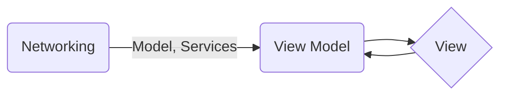

## Introduction

This repo was created for beginning of reactive programming in Swift iOS projects. Also, it's my first attempt to use RxSwift. Of course, I'm not saying %100 this is very well - super - example of a Reactive programming boilerplate :)


## Project Structure
Only difference from MVVM design pattern is Model layer is encapsulated by Networking layer. Don't be confused.

SwiftyRxMVVM
- Networking
- ViewModel
- View
- Helpers
	- Config -> Environment
- Resources
- ...

SwiftyRxMVVMTests
- Specs
- ...

## Libraries

**Main**
* SwiftLint
* Moya
* R
* RxSwift

**Test**
* Quick
* Nimble

## Choosing Environment

All you have to do is define API base url in Config-*.plist in order to work on different scenarios.

## Install
Cocoapods dependencies are used.
```
pod install
```

For Out-of-dated repos If needs
```
pod install --repo-update 
```

## Simple Chart

